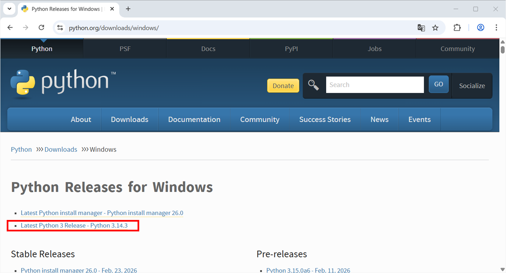
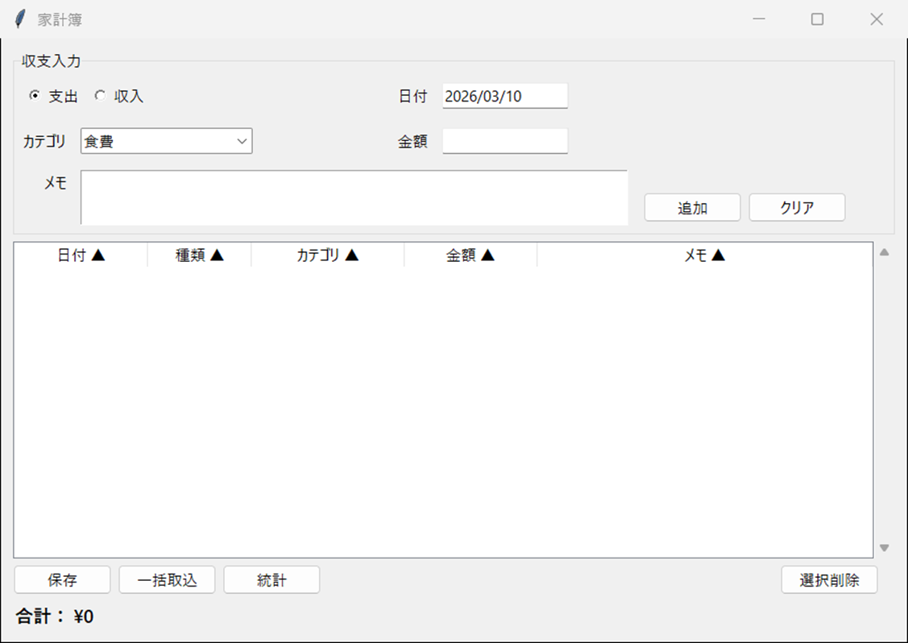

# 家計簿アプリケーション

Python + Tkinterで作成したシンプルな家計簿管理アプリケーションです。支出・収入の記録、CSV入出力、統計表示機能を備えています。

## 目次

- [機能概要](#機能概要)
- [実行環境](#実行環境)
- [環境構築](#環境構築)
- [起動方法](#起動方法)
- [使い方](#使い方)
- [ファイル構成](#ファイル構成)
- [データ仕様](#データ仕様)

---

## 機能概要

### 主要機能

1. **収支管理**
   - 支出・収入の記録
   - カテゴリ別の分類
   - メモ機能

2. **データ操作**
   - 追加・編集・削除
   - CSV形式での保存・読込
   - データの一覧表示

3. **統計表示**
   - カテゴリ別集計（円グラフ）
   - 年別集計（棒グラフ）
   - 月別集計（棒グラフ）
   - 支出/収入の切り替え表示

4. **合計表示**
   - ネット残高（収入 - 支出）
   - 支出・収入の内訳表示

---

## 実行環境

### 必須要件

- **Python**: 3.7以上
- **OS**: Windows

### 標準ライブラリ（追加インストール不要）

- `tkinter` - GUI構築
- `csv` - CSV入出力
- `datetime` - 日付処理
- `decimal` - 金額計算

### オプショナルライブラリ（統計機能用）

統計表示機能を使用する場合は以下が必要です：

- `pandas` - データ集計
- `matplotlib` - グラフ描画

---

## 環境構築

### 1. Pythonのインストール

https://www.python.org/downloads/windows/


※詳細の手順は別途準備


Python 3.7以上がインストールされているか確認してください。

```powershell
py --version
```

### 2. オプショナルライブラリのインストール

統計機能を使用する場合は、以下のコマンドを実行してください：

```powershell
pip install pandas matplotlib
```

**注意**: 統計機能が不要な場合、このステップはスキップできます。基本的な収支記録とCSV入出力は標準ライブラリのみで動作します。

詳細なファイル構成は「[ファイル構成](#ファイル構成)」セクションを参照してください。

---

## 起動方法

### Windows (PowerShell)

```powershell
cd c:\[任意のフォルダ]\kakeibo\src
py -m kakeibo_app
```

### 起動確認

正常に起動すると、以下のようなウィンドウが表示されます：


---

## 使い方

### 1. 収支の追加

1. **種類を選択**: 「支出」または「収入」のラジオボタンを選択
2. **日付を入力**: YYYY/MM/DD形式（例: 2026/01/20）
3. **カテゴリを選択**: 種類に応じたカテゴリがドロップダウンに表示
4. **金額を入力**: 数値のみ、または「¥1,234」形式
5. **メモを入力**: 任意のメモを記入（省略可）
6. **「追加」ボタンをクリック**

#### 支出カテゴリ

- 食費
- 日用品
- 交通
- 交際費
- 娯楽
- 住居
- 光熱費
- 医療
- 教育
- 貯金
- その他

#### 収入カテゴリ

- 給与
- ボーナス
- 副業
- 投資
- その他収入

### 2. 収支の編集

1. 一覧から編集したい行を**ダブルクリック**
2. フォームに内容が反映される
3. 必要な項目を修正
4. **「更新」ボタンをクリック**

### 3. 収支の削除

1. 一覧から削除したい行を選択（複数選択可: Ctrl + クリック）
2. **「選択削除」ボタンをクリック**
3. 確認ダイアログで「はい」を選択

### 4. フォームのクリア

**「クリア」ボタン**をクリックすると、入力フォームがリセットされます。

### 5. ファイル保存

1. **「保存」ボタンをクリック**
2. 保存先とファイル名を指定
3. データがCSV形式で保存される

#### CSV形式

```csv
日付,種類,カテゴリ,金額,メモ
2026/01/20,支出,食費,1500,スーパーで買い物
2026/01/20,収入,給与,250000,1月分給与
```

### 6. ファイル読込

1. **「一括取込」ボタンをクリック**
2. 読み込むCSVファイルを選択
3. バリデーションを通過したデータのみが追加される

#### 読込時のバリデーション

- 日付: YYYY/MM/DD形式
- 種類: 「支出」または「収入」
- カテゴリ: 空または不正値は既定カテゴリへ自動補正
- 金額: 1以上の数値

### 7. 統計表示

1. **「統計」ボタンをクリック**
2. 統計ウィンドウが開く（pandas/matplotlibが必要）

#### 統計タブ

- **カテゴリ別**: 円グラフとテーブル
- **年別**: 棒グラフとテーブル
- **月別**: 棒グラフとテーブル

各タブで「支出」「収入」を切り替えて表示できます。

---

## ファイル構成

```
src/kakeibo_app/                # メインパッケージ
├── __init__.py                  # パッケージマーカー・公開API定義
├── __main__.py                  # エントリーポイント(-m kakeibo_app 実行時)
├── constants.py                 # 【定数層】カテゴリ・取引型定義
├── formatters.py                # 【フォーマッタ層】金額表示フォーマット
├── validators.py                # 【バリデータ層】入力検証・型変換
├── models.py                    # 【モデル層】トランザクション・データ管理
├── app.py                       # 【起動層】DPI設定・アプリ初期化
└── ui/                          # 【UI層】ユーザーインターフェース
    ├── __init__.py
    ├── main/                    # メイン画面（画面別フォルダ構成）
    │   ├── __init__.py
    │   ├── view.py              # GUI構築（Tkinter ウィジェット）
    │   └── logic.py             # イベントハンドラ・業務ロジック
    └── summary/                 # 統計表示画面
        ├── __init__.py
        ├── view.py              # GUI構築（Toplevel, Notebook, Canvas）
        └── logic.py             # データ集計・テーブルイベント連携

README.md                        # このファイル
```

---

## アーキテクチャ（責務の分離）

このアプリケーションは、関心の分離の原則に基づき、以下の **各層が明確な責務を持つ** 構成になっています。

```
【起動層】
  app.py + __main__.py
    ↓
【UI層】ui/main/（view.py ↔ logic.py）
      ui/summary/（view.py ↔ logic.py）
    ↓
【モデル層】models.py
【バリデータ層】validators.py
【フォーマッタ層】formatters.py
【定数層】constants.py
```

### 層の役割

- **起動層**: DPI設定、Tkinter スタイル適用、メインループ実行
- **UI層**: 画面単位でディレクトリ分割
  - view.py: Tkinter ウィジェット管理・GUI構築
  - logic.py: イベント処理・業務ロジック
- **モデル層**: トランザクションデータ管理・永続化
- **バリデータ層**: 入力検証・型変換
- **フォーマッタ層**: データ表示形式変換
- **定数層**: カテゴリ・取引種別一元管理

---

### 1. 定数層（Constants）

**ファイル:** `constants.py`

**責務:** アプリケーション全体で使用するカテゴリ・取引種別を一元管理

**定義内容:**
- `EXPENSE_CATEGORIES` - 支出カテゴリ（11種類）
- `INCOME_CATEGORIES` - 収入カテゴリ（5種類）
- `TRANSACTION_TYPES` - 取引種別（「支出」「収入」）

**依存関係:** なし（最下位レイヤー）

---

### 2. フォーマッタ層（Formatters）

**ファイル:** `formatters.py`

**責務:** データを表示形式に変換

**関数:**
- `format_yen(value: Decimal) -> str` - 金額を「¥1,234」形式にフォーマット

**使用箇所:** UI層で金額表示時に呼び出し

**依存関係:** `decimal` 標準ライブラリのみ

---

### 3. バリデータ層（Validators）

**ファイル:** `validators.py`

**責務:** ユーザーの入力を検証し、正しい型に変換

**主要関数:**
- `parse_date(text: str) -> date` - 日付文字列を検証・変換（YYYY/MM/DD形式）
- `parse_decimal(text: str) -> Decimal` - 金額文字列を変換（「¥1,234」形式対応）
- `parse_price(text: str) -> Decimal` - 金額文字列を検証して変換（1未満をエラー）
- `validate_transaction_type(text, transaction_types) -> str` - 種別検証
- `normalize_category(...) -> str` - カテゴリ正規化（空・不正は既定値）
- `build_transaction_from_form(...) -> Transaction` - フォーム入力を一括検証してモデル生成
- `build_transaction_from_row(...) -> Transaction` - CSV行を検証してモデル生成

**使用箇所:** UI層でのフォーム検証に使用

**依存関係:** `decimal`、`datetime` 標準ライブラリのみ

**利点:**
- UI ロジックと独立 → テストが容易
- エラーメッセージが明確（empty、format_error、invalid_date、invalid_price、negative_price など）
- 他のプログラムでも再利用可能

---

### 4. モデル層（Models）

**ファイル:** `models.py`

**責務:** トランザクションデータと永続化ロジックを管理

**主要クラス:**

#### 4.1 `Transaction` クラス
```python
class Transaction:
    """個別の取引データを表すモデル"""
    def __init__(self, date, transaction_type, category, price, memo="")
    def to_dict() -> dict       # 辞書に変換
```

**属性:**
- `date` - 日付（YYYY/MM/DD形式）
- `transaction_type` - 「支出」または「収入」
- `category` - カテゴリ
- `price` - 金額（Decimal）
- `memo` - メモ

#### 4.2 `TransactionManager` クラス
```python
class TransactionManager:
    """トランザクション群の管理・永続化"""
    def add_transaction(iid, transaction)           # 追加
    def update_transaction(iid, transaction)        # 更新
    def delete_transaction(iid)                     # 削除
    def get_transaction(iid) -> dict                # 1件取得
    def get_all_items() -> Dict              # 全件取得
    def calculate_totals() -> tuple          # 合計計算（支出,収入,ネット）
    def export_csv(path) -> int              # CSV保存
    def import_csv(path, validators) -> tuple # CSV読込
```

**使用箇所:** 主に UI 層 `ui/main/logic.py` でデータ操作時に使用（summary は集計表示で参照）

**依存関係:** `csv`、`decimal`、`datetime`、`pathlib` 標準ライブラリのみ

---

### 5. UI層（User Interface）

**ディレクトリ:** `ui/`

**構成:** 画面単位でディレクトリを分割し、各画面ごとに `view.py`（GUI構築）と `logic.py`（イベント処理・ロジック）に分離

**責務:**
- **view.py**: Tkinter ウィジェット管理、レイアウト、GUI構築
- **logic.py**: ユーザーイベント処理、業務ロジック、データ操作

#### 5.1 `ui/main/` - メイン画面

##### `ui/main/view.py`

**クラス:** `KakeiboApp(tk.Tk)`

**責務:** メイン画面の GUI 構築

**主要メソッド:**
- GUI 初期化関数
  - `_build_ui()` - GUI 構築（入力フォーム、Treeview、ボタン、合計表示）
  - `_get_heading_text(col)` - ソート状態に応じた列ヘッダーテキスト生成
- イベント委譲メソッド（実装は logic.py に委譲）
  - `on_sort_column(col)`, `_on_type_changed()`
  - `on_add_or_update()`, `on_clear_inputs()`, `on_delete_selected()`
  - `on_export_csv()`, `on_import_csv()`, `on_show_summary()`
  - `on_tree_double_click(event)` - Treeview ダブルクリック時の編集開始
  - `_exit_edit_mode()` - 編集モード終了

**依存関係:** `logic` モジュールからイベントハンドラーをインポート

##### `ui/main/logic.py`

**責務:** メイン画面のイベント処理と業務ロジック

**主要関数:**
- `on_sort_column(app, col)` - Treeview 列ヘッダークリック時のソート処理
- `apply_sort(app)` - ソート条件を適用し Treeview を再構築
- `on_type_changed(app)` - 種類（支出/収入）切り替え時のカテゴリドロップダウン更新
- `on_add_or_update(app)` - 収支の追加・更新処理
  - フォーム検証 → `validators` で入力チェック
  - `models.TransactionManager` でデータ登録
  - 合計額を再計算
- `on_clear_inputs(app)` - フォーム入力フィールドをリセット
- `on_tree_double_click(app, event)` - Treeview 行をダブルクリック時、その行を編集フォームに読込
- `exit_edit_mode(app)` - 編集モード終了（フォーム内容をクリア、編集フラグ解除）
- `on_delete_selected(app)` - 選択行の削除（確認ダイアログ）
- `on_show_summary(app)` - Summary ウィンドウをオープン（pandas/matplotlib 遅延インポート）
- `on_export_csv(app)` - ファイル保存ダイアログで CSV 保存
- `on_import_csv(app)` - ファイル選択ダイアログで CSV 読込
- `update_total(app)` - 合計額（支出、収入、ネット）を計算して表示更新

**依存関係:**
- `constants` - カテゴリ・取引種別
- `formatters` - `format_yen()`
- `validators` - `build_transaction_from_form()`, `build_transaction_from_row()`
- `models` - `Transaction`, `TransactionManager`

#### 5.2 `ui/summary/` - 統計表示ウィンドウ

##### `ui/summary/view.py`

**クラス:** `Summary(tk.Toplevel)`

**責務:** 統計表示ウィンドウの GUI 構築

**主要メソッド:**
- `_create_tab(tab_name, renderer_method)` - タブの生成
  - 各タブで `type_var`（支出/収入）を管理
  - フィルターボタンとコンテンツフレームを生成
- 各タブの描画メソッド
  - `_render_category_tab(body_frame, type_var)` - カテゴリ別タブ
  - `_render_yearly_tab(body_frame, type_var)` - 年別タブ
  - `_render_monthly_tab(body_frame, type_var)` - 月別タブ
  - `_render_sample_tab(body_frame, type_var)` - サンプルタブ（参考実装）
- テーブル関連
  - `_create_table(...)` - テーブル初期化
  - `_on_table_sort(...)` - 列クリックイベント（実処理は logic.py 委譲）

**依存関係:** `logic` モジュールから描画関数をインポート

##### `ui/summary/logic.py`

**責務:** データ集計、テーブルソートイベント連携

**主要関数:**
- `filtered_items(items, target)` - 支出/収入でデータをフィルタリング
- `summarize_by_category(items, target)` - カテゴリ別集計（合計・件数・割合）
- `summarize_by_year(items, target)` - 年別集計（合計・件数）
- `summarize_by_month(items, target)` - 月別集計（合計・件数）
- `update_table_headers(app, tree, columns, category_label, sort_state, df)` - ヘッダー更新とクリックイベント配線
- `on_table_sort(app, col, tree, columns, category_label, sort_state, df)` - ソート状態更新と再描画

**依存関係:**
- `pandas` - データフレーム操作（外部パッケージ）

※ グラフ描画（matplotlib）は `ui/summary/view.py` 側で実装

**設計上の特徴:**
- 集計ロジックと UI 描画を分離
- テーブルイベント処理を関数化し、view から委譲
- テスト・保守が容易

---

### 6. 起動層（Bootstrap）

**ファイル:** `app.py`、`__main__.py`

**責務:**
- Windows の DPI 認識設定
- Tkinter スタイルの適用
- アプリケーションメインループの実行
- 例外のキャッチと表示

**app.py の関数:**
- `main()` - アプリケーション起動エントリーポイント

**__main__.py の役割:**
```python
from .app import main
if __name__ == "__main__":
    main()
```
- `python -m kakeibo_app` コマンドでアプリケーションを起動するためのエントリーポイント

**依存関係:** `ui.main.view.KakeiboApp` のみ

---

## データフロー

### ユーザー入力から表示まで

1. **入力フォーム（view.py で構築）**
   - ユーザーが日付・金額を入力  
   - → `logic.py` にイベント委譲

2. **検証・型変換（logic.py で実行）**
  - `validators.build_transaction_from_form()` で正当性チェックと型変換
   - エラーがあればメッセージボックス表示

3. **データ管理**
   - `Transaction` オブジェクト生成
  - → `models.TransactionManager.add_transaction()` で登録

4. **Treeview 表示**
   - `formatters.format_yen()` で「¥1,234」に変換
   - → `view.py` の Treeview に反映

5. **合計計算**
   - `TransactionManager.calculate_totals()` で合計を計算
   - → `formatters.format_yen()` で表示形式に変換
   - → `view.py` で合計ラベル更新

6. **統計表示**
  - `summary/logic.py` でデータ集計（pandas）
  - `summary/view.py` でテーブル/グラフ描画（Tkinter + matplotlib）

7. **永続化**
   - `TransactionManager.export_csv(path)` で CSV 保存
   - `TransactionManager.import_csv(path, validators)` で CSV 読込

---

## データ仕様

### 内部データ構造

```python
{
    "iid_001": {
      "date": "2026/01/20",
        "transaction_type": "支出",
        "category": "食費",
        "price": Decimal("1500"),
        "memo": "スーパーで買い物"
    }
}
```

### 金額計算ロジック

```
ネット残高 = 収入合計 - 支出合計
```

### データ永続化

- メモリ上でのみ管理（アプリ終了でデータ消失）
- データファイル（CSV形式）で保存・読込が可能

---

## トラブルシューティング

### 統計ボタンを押すとエラーが出る

**原因**: pandas/matplotlibがインストールされていない

**解決方法**:
```powershell
pip install pandas matplotlib
```

### CSVファイルが文字化けする

**原因**: Excelで開いた場合、UTF-8が正しく認識されない

**解決方法**:
- テキストエディタで開く
- Excelの場合は「データ」→「テキストから」で読み込み、エンコーディングをUTF-8に指定

### 日付入力でエラーが出る

**原因**: 日付形式が間違っている

**解決方法**: YYYY/MM/DD形式で入力（例: 2026/01/20）

### 金額に小数点が入力できない

**仕様**: 内部でDecimal型を使用していますが、表示は整数に丸められます

**解決方法**: 金額は整数で入力してください（例: 1500）。小数点以下は切り捨てられます。