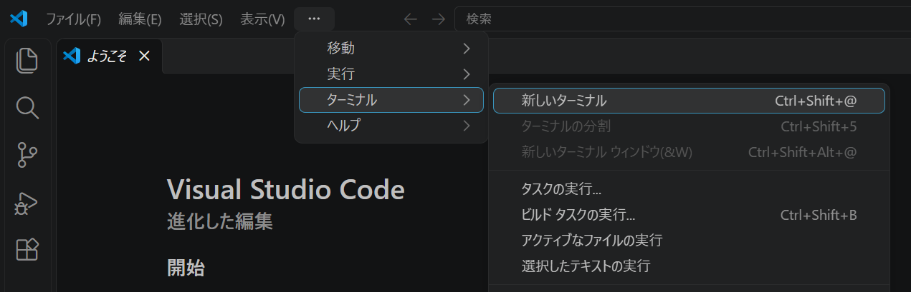
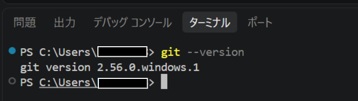
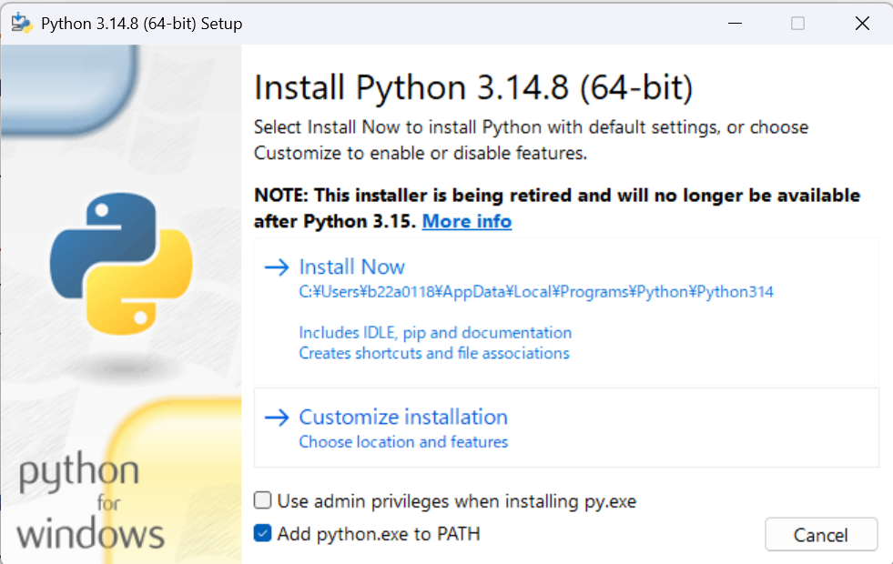
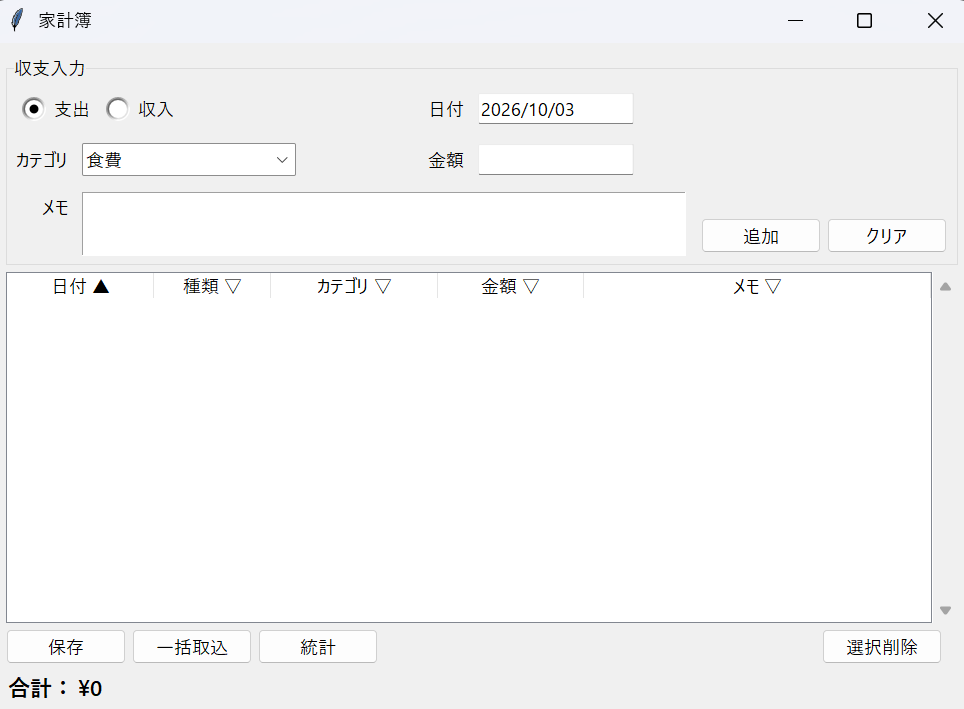

# 家計簿アプリケーション

Python + Tkinterで作成したシンプルな家計簿管理アプリケーションです。日々の支出・収入をカテゴリ別に記録し、CSV形式での保存・読込や、カテゴリ別・年別・月別の統計表示を行うことができます。

データはアプリ実行中はメモリ上で管理され、CSVファイルに保存することで永続化します。

## 目次

- [1. 概要](#1-概要)
- [2. 主な機能](#2-主な機能)
- [3. 必要環境](#3-必要環境)
- [4. セットアップ](#4-セットアップ)
- [5. 起動方法](#5-起動方法)
- [6. 使い方](#6-使い方)
  - [6.1 収支の追加](#61-収支の追加)
  - [6.2 収支の編集](#62-収支の編集)
  - [6.3 収支の削除](#63-収支の削除)
  - [6.4 フォームのクリア](#64-フォームのクリア)
  - [6.5 金額・日付の入力ルール](#65-金額日付の入力ルール)
  - [6.6 カテゴリ](#66-カテゴリ)
- [7. CSV入出力](#7-csv入出力)
  - [7.1 CSV形式](#71-csv形式)
  - [7.2 エクスポート](#72-エクスポート)
  - [7.3 インポート](#73-インポート)
- [8. 統計機能](#8-統計機能)
- [9. データ仕様](#9-データ仕様)
- [10. プロジェクト構成](#10-プロジェクト構成)
- [11. テスト](#11-テスト)
- [12. トラブルシューティング](#12-トラブルシューティング)

---

## 1. 概要

家計簿アプリケーションは、日々の支出・収入をカテゴリ別に記録・管理するためのシンプルなデスクトップアプリケーションです。収支の一覧表示、CSVファイルによるデータの保存・読込、カテゴリ別／年別／月別の統計表示（グラフ・表）を行うことができます。

Windows上で動作するTkinter製のGUIアプリケーションです。

---

## 2. 主な機能

- 支出・収入の登録（種類・日付・カテゴリ・金額・メモ）
- カテゴリ別の分類管理
- メモの記入
- 登録済み収支の編集・削除
- CSVファイルへの保存、CSVファイルからの読込
- 合計金額の表示（支出合計・収入合計・ネット残高）
- 統計表示（カテゴリ別・年別・月別の集計とグラフ表示）

---

## 3. 必要環境

### 必須

- **OS**: Windows
- **Python**: 3.14.8（このバージョンで固定）

### 依存ライブラリ

`pyproject.toml` の `dependencies` に定義されている、統計機能で使用する依存ライブラリです。通常のインストール手順に従えば自動的にインストールされます。

- `pandas` (>= 2.0)
- `matplotlib` (>= 3.7)

同一環境を再現したい場合は、[requirements-lock.txt](requirements-lock.txt) に全依存パッケージ（推移的な依存を含む）のバージョンを固定しているので、そちらを使ってください（下記セットアップ手順を参照）。

---

## 4. セットアップ

### 4.1. VSCodeのインストール

sharepointの`installer.zip` をローカルにコピーしてzipを解凍する  
※sharepointについては有識者に確認してください。

解凍後、`installer\VSCodeUserSetup-x64-1.140.0.exe`を実行する

※日本語化するときは「https://www.javadrive.jp/vscode/install/index4.html 」を参照

### 4.2. Gitのインストール

解凍したフォルダの中の、`installer\Git-2.56.0-64-bit.exe`を実行する

#### Gitのインストール確認
1. VSCodeを起動
2. 新しいターミナルを表示

3. ターミナルで「git --version」のコマンドを実行  
下記画像のように表示されていればOK


#### VSCodeでGitを使用するための初期設定

設定コマンド
```powershell
git config --global user.name "xxx"
git config --global user.email "xxxxxxxx+username@users.noreply.github.com"
```
※コミット履歴に記録されるユーザー情報設定。ユーザー名、メールアドレスは任意の値に書きかえる。メールアドレスはダミーでよい。

#### リポジトリのクローン
任意のフォルダに移動してリポジトリをクローン

```powershell
# 任意のディレクトリに移動
cd  ./work
# リポジトリのクローン
git clone https://github.com/ksaplabo-org/kakeibo.git
```


### 4.3. Pythonのインストール

解凍したフォルダの中の、`installer\python-3.14.8-amd64.exe`を実行する

> ⚠️ **注意**：必ず「**Add python.exe to PATH**」にチェックを入れること
> 


#### Pythonのインストール確認

```powershell
py -3.14 --version
```

> **複数バージョンのPythonが入っている場合の注意**
> `python --version` はPATHの順序によってどのバージョンが呼ばれるか不定なため、`py -3.14`（Python Launcher）でバージョンを明示的に指定してください。Windows版Pythonには標準で `py` ランチャーが同梱されています。

### 4.4. 仮想環境の作成

他プロジェクトの依存関係と混在しないよう、仮想環境の作成を推奨します。バージョンを明示するため `py -3.14` で作成してください。

```powershell
# 仮想環境の作成
py -3.14 -m venv .venv
# 仮想環境をアクティブにする
.venv\Scripts\activate
```

venvを作成・activateした後は、`python`/`pip`コマンドは自動的にこの `.venv` 内の Python 3.14.8 を指すようになります。

### 4.5. プロジェクトのインストール

**環境を完全に再現したい場合**（依存パッケージのバージョンを固定してインストール。`pytest` も含まれているのでテスト実行も可能）：

```powershell
pip install -r requirements-lock.txt
pip install -e . --no-deps
```

```powershell
# テスト実行
pytest
```

**通常利用の場合**（最新の対応バージョンを許容してインストール）：

```powershell
pip install -e .
```

**開発（テスト実行など）を行う場合**：

```powershell
pip install -e ".[dev]"
```

`pyproject.toml` に定義された依存ライブラリ（pandas、matplotlibなど）が自動的にインストールされます。

### 4.6 片づけ方（仮想環境の終了・削除）

作業が終わったら、まず仮想環境から抜けます。

```powershell
deactivate
```

`.venv` フォルダ自体が不要になった場合は削除して構いません（`pip install`でコピーされたファイルのみで、システム側のPythonやプロジェクトのソースコードには影響しません。再度必要になったら上記「2. 仮想環境の作成」からやり直せば同じ状態を再現できます）。

```powershell
deactivate
Remove-Item -Recurse -Force .venv
```

---

## 5. 起動方法

インストール後は、以下のコマンドで起動します。

```powershell
# kakeibo/srcに移動
cd  ./work/kakeibo/src
# 起動
python -m kakeibo_app
```

### 起動確認

正常に起動すると、以下のようなウィンドウが表示されます。

- タイトル: 「家計簿」
- ウィンドウサイズ: 820x560



---

## 6. 使い方

### 6.1 収支の追加

1. **種類を選択**: 「支出」または「収入」のラジオボタンを選択
2. **日付を入力**: `YYYY/MM/DD` 形式（例: 2026/01/20）
3. **カテゴリを選択**: 種類に応じたカテゴリが一覧から選べます
4. **金額を入力**: 詳細は [6.5 金額・日付の入力ルール](#65-金額日付の入力ルール) を参照
5. **メモを入力**: 任意のメモを記入（省略可）
6. **「追加」ボタンをクリック**

### 6.2 収支の編集

1. 一覧から編集したい行を**ダブルクリック**
2. フォームに内容が反映される
3. 必要な項目を修正
4. **「更新」ボタンをクリック**

### 6.3 収支の削除

1. 一覧から削除したい行を選択（複数選択可: Ctrl + クリック）
2. **「選択削除」ボタンをクリック**
3. 確認ダイアログで「はい」を選択

### 6.4 フォームのクリア

**「クリア」ボタン**をクリックすると、入力フォームがリセットされます。

### 6.5 金額・日付の入力ルール

#### 金額

- **1以上の整数**（0、負数、小数は入力エラーになります）
- 上限はありません
- 先頭に `¥` を付けられます
- 3桁区切りのカンマを使用できます（正しい3桁区切りの場合のみ有効）
- 全角数字も入力できます（自動的に半角数字として扱われます）

入力例（いずれも有効）:

```text
1000
1,000
¥1,000
１０００
```

無効な入力例:

```text
0          → 1以上ではない
-1000      → 負数
1000.5     → 小数
1,00       → 3桁区切りが不正
```

#### 日付

- `YYYY/MM/DD` 形式（例: `2026/01/20`）
- `YYYY/M/D` のように月・日のゼロ埋めを省略した形式も有効（例: `2026/1/20`）
- 区切り文字は `/` のみで、`-` 区切り（`2026-01-20`など）は無効です
- 実在する日付である必要があります（例: `2026/02/30` は無効）

### 6.6 カテゴリ

カテゴリは種類（支出／収入）に応じて用意された一覧から選択します（自由入力はできません）。

#### 支出カテゴリ

- 食費
- 日用品
- 交通
- 交際費
- 娯楽
- 住居
- 光熱費
- 医療
- 教育
- 貯金
- その他

#### 収入カテゴリ

- 給与
- ボーナス
- 副業
- 投資
- その他収入

---

## 7. CSV入出力

### 7.1 CSV形式

基本の形式は以下の5列です。

```csv
日付,種類,カテゴリ,金額,メモ
2026/01/20,支出,食費,1500,スーパーで買い物
2026/01/20,収入,給与,250000,1月分給与
```

- ヘッダー行（`日付,種類,カテゴリ,金額,メモ`）は自動的に認識されます。ヘッダー行がないファイルも読み込めます
- インポート時は **4列（メモ列なし）または5列** の行を受け付けます。6列以上ある行は不正な行として扱われます
- 空行は無視されます
- 文字コード
  - **読込**: UTF-8（BOMなし・BOM付きのどちらにも対応）
  - **書出**: UTF-8（BOMなし）

### 7.2 エクスポート

「保存」ボタンでCSVファイルに書き出します。

- ヘッダー行を必ず出力します
- **日付順**（昇順）に出力されます。同じ日付のデータが複数ある場合は、登録・取込した順序が維持されます

### 7.3 インポート

「一括取込」ボタンでCSVファイルを読み込みます。読込時の重要な仕様は以下のとおりです。

- 読み込んだデータは **既存データに追記** されます。既存データが置き換わることはありません
- 各行は個別に検証され、**正しい行だけが取り込まれる部分成功方式** です。日付・金額・種類・カテゴリ・列数などが仕様に合わない行はスキップされます
- 取込後、成功した件数とスキップされた件数がメッセージで表示されます
- **同じ内容の重複チェックは行われません**。同じCSVファイルを2回読み込むと、データが2重に登録されます。再取込を行う際は注意してください
- ファイル自体が開けない・読めない場合（文字コードの問題やファイル破損など）は、取込は行われません

---

## 8. 統計機能

「統計」ボタンをクリックすると、統計ウィンドウが開きます。以下の3種類のタブで、支出・収入を切り替えながら集計結果を確認できます。

- **カテゴリ別**: カテゴリごとの合計・件数・割合（円グラフとテーブル）
- **年別**: 年ごとの合計・件数（棒グラフとテーブル）
- **月別**: 月ごとの合計・件数（棒グラフとテーブル）

統計機能の集計・グラフ描画には pandas と matplotlib を使用しています。

---

## 9. データ仕様

- **金額**: 日本円の整数（詳細は [6.5](#65-金額日付の入力ルール) を参照）
- **日付**: `YYYY/MM/DD`（詳細は [6.5](#65-金額日付の入力ルール) を参照）
- **種類**: 「支出」または「収入」
- **カテゴリ**: 種類ごとに定義された一覧から選択（[6.6](#66-カテゴリ) を参照）
- **メモ**: 任意の文字列（省略可）
- **合計計算**: ネット残高 = 収入合計 − 支出合計

データはアプリ実行中のみメモリ上に保持され、アプリを終了するとデータは失われます。データを残したい場合は、CSVファイルとして保存してください。

---

## 10. プロジェクト構成

```text
kakeibo/
├── pyproject.toml
├── README.md
├── samples/                             # サンプルCSVデータ
├── src/
│   └── kakeibo_app/
│       ├── app.py                      # 起動処理（DPI設定・スタイル適用・メインループ）
│       ├── __main__.py                 # `python -m kakeibo_app` のエントリーポイント
│       ├── shared/                     # 複数画面で共有する処理
│       │   ├── constants.py            # カテゴリ・取引種別の定義
│       │   ├── models.py               # 取引データの型定義
│       │   ├── validation.py           # 入力値・CSV行の検証
│       │   ├── formatters.py           # 表示用の文字列整形
│       │   ├── balance.py              # 合計計算
│       │   └── csv_storage.py          # CSV入出力
│       └── features/                   # 画面単位の機能
│           ├── transaction_entry/      # 収支入力画面
│           │   ├── repository.py       # 取引データの保持・管理
│           │   ├── logic.py            # イベント処理
│           │   └── view.py             # 画面構築
│           └── summary/                # 統計表示画面
│               ├── aggregation.py      # 統計集計処理
│               ├── logic.py            # 集計結果の表示・グラフ描画
│               └── view.py             # 画面構築
└── tests/                              # 自動テスト
```

---

## 11. テスト

開発用の依存関係をインストールしたうえで、以下を実行します。

```powershell
pip install -e ".[dev]"
pytest
```

---

## 12. トラブルシューティング

### `.venv\Scripts\activate` を実行すると「スクリプトの実行が無効になっている」エラーが出る

**原因**: Windows PowerShellの実行ポリシーにより、既定では `Activate.ps1` などの未署名スクリプトの実行がブロックされています。

**解決方法**: 同じPowerShellウィンドウ内で、activateする前に以下を実行してください。

```powershell
Set-ExecutionPolicy -Scope Process -ExecutionPolicy Bypass
.venv\Scripts\activate
```

`-Scope Process` により、今開いているPowerShellウィンドウだけに一時的に適用されます（ウィンドウを閉じれば元に戻り、システム全体の設定は変更されません。管理者権限も不要です）。ウィンドウを開き直すたびに、この1行を再度実行する必要があります。

毎回入力するのが煩わしい場合は、現在のユーザーに対して恒久的に許可することもできます（管理者権限は不要ですが、設定の永続的な変更になります）。

```powershell
Set-ExecutionPolicy -Scope CurrentUser -ExecutionPolicy RemoteSigned
```

### CSVファイルが文字化けする、または取込時にエラーが出る

このアプリの読込は UTF-8（BOMなし・BOM付きのどちらも）に対応しているため、Excelなどで「CSV UTF-8」として保存したファイルもそのまま読み込めます。

このアプリが書き出すCSVはBOMなしのUTF-8です。エクスポートしたファイルを他のアプリで開く際に文字化けする場合は、開く側でUTF-8として読み込むよう指定してください。

UTF-8 以外の文字コード（Shift-JIS など）で保存されたファイルを一括取込しようとすると、「ファイルの文字コードを読み取れませんでした」というエラーが表示されます。その場合はファイルを UTF-8 で保存し直してから再度お試しください。

### 日付入力でエラーが出る

**原因**: 日付の形式が正しくない

**解決方法**: `YYYY/MM/DD`（例: `2026/01/20`）または `YYYY/M/D`（例: `2026/1/20`）の形式で、実在する日付を入力してください。`YYYY-MM-DD` のようなハイフン区切りは使用できません。

### 金額に小数点が入力できない

**仕様**: 金額は整数のみを受け付けます。小数を入力するとエラーになり、登録されません。

**解決方法**: 金額は整数で入力してください（例: `1500`）。
